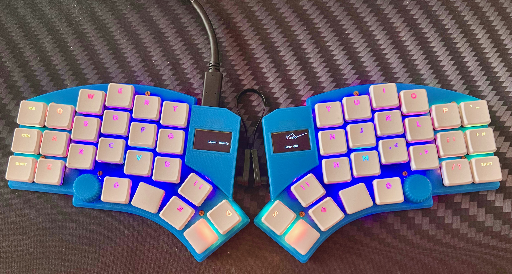

# Camping-Kyria-Case

A really low profile Kyria Case for Choc hotswap switches. Bottom plates with cutouts for hotswap sockets. 

Top plate is 1.2mm and has a 0.8mm mid layer to make the PCB sit flush against the PCB which eases removing and inserting switches.

Bottom plate is 2.2mm high with component cutouts to make the case extremely low profile.

Make sure to print with the top plate facing the print surface. 

The bottom plate should be printed with the bottom facing the print surface. 

The knob fits EC12 encoders. The LCD Cover fits all Kyria cases.

